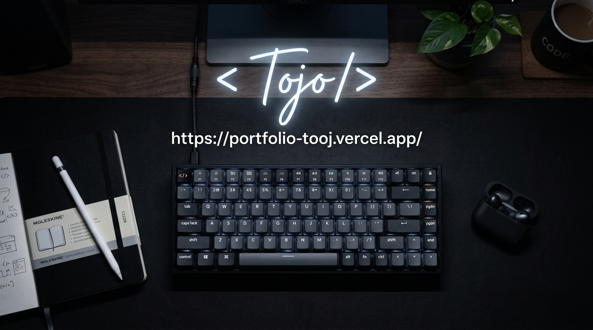

  

  

<h3 align="left">Code | Improve | Innovate</h3>

---

  
<b> À propos de moi</b>

   
  <ul>
    <li>💻 <strong>Développeur Full-Stack</strong></li>
    <li>🌱 <strong>Apprentissage continu des nouvelles technologies</strong></li>
    <li>🧠 <strong>Maîtrise des structures de données, des algorithmes et de la résolution de problèmes.</strong> Je privilégie un code propre, maintenable et évolutif, tout en valorisant le travail collaboratif et les bonnes pratiques de développement.</li>
    <li>⚡ <strong>Curieux & rigoureux :</strong> J'apprends vite et je livre du code fiable, testé et soigné.</li>
    <li>🔄 <strong>Fullstack de bout en bout :</strong> Du design de l'API à l'interface, je maîtrise toute la chaîne.</li>
    <li>🎯 <strong>Product Owner :</strong> Je traduis le besoin métier en user stories et en sprints.</li>
    <li>💡 <strong>Mon approche :</strong> Comprendre, concevoir, créer, améliorer.</li>
    <li>🐳 <strong>Conteneurisation et déploiement Cloud avec Docker.</strong></li>
    <li>🎯 <strong>Passionné par la création de solutions numériques utiles, robustes et performantes.</strong></li>
  </ul>

 

  
<b> Compétences & Outils</b>

   
  <h4> Langages de programmation</h4>
  

    
    
    
    
    
    
  

  <h4> Frameworks & Technologies</h4>
  

    
    
    
    
    
    
    
    
    
  

  <h4> Outils & DevOps</h4>
  

    
    
    
    
    
    
  

  <h4> Bases de données</h4>
  

    
    
    
    
  

 

  
<b> GitHub Activity</b>

   
  

    
    
  

  

    
  

 

  
<b> Projets à la une</b>

   
  <h3>🎓 Élaboration et mise en œuvre d'un système de Gestion des Soutenances de Mémoire</h3>
  
Une plateforme web et mobile pour la gestion des soutenances de mémoire de Master.

  
<strong>Technologies :</strong> <code>Spring Boot</code> <code>Angular</code> <code>PostgreSQL</code> <code>Docker</code>

  
<strong>Fonctionnalités principales :</strong>

  <ul>
    <li>👨‍🎓 Gestion des étudiants</li>
    <li>📚 Gestion des mémoires</li>
    <li>👨‍🏫 Gestion des enseignants</li>
    <li>⚖️ Gestion des jurys</li>
    <li>🏫 Gestion des salles</li>
    <li>📅 Planification des soutenances</li>
    <li>🔔 Système de notifications</li>
  </ul>

 

  
<b> Contact & Portfolio</b>

   
  

    <strong>Portfolio :</strong> <a href="https://portfolio-tooj.vercel.app/" target="_blank">https://portfolio-tooj.vercel.app/</a>
  

  

    
    
  

